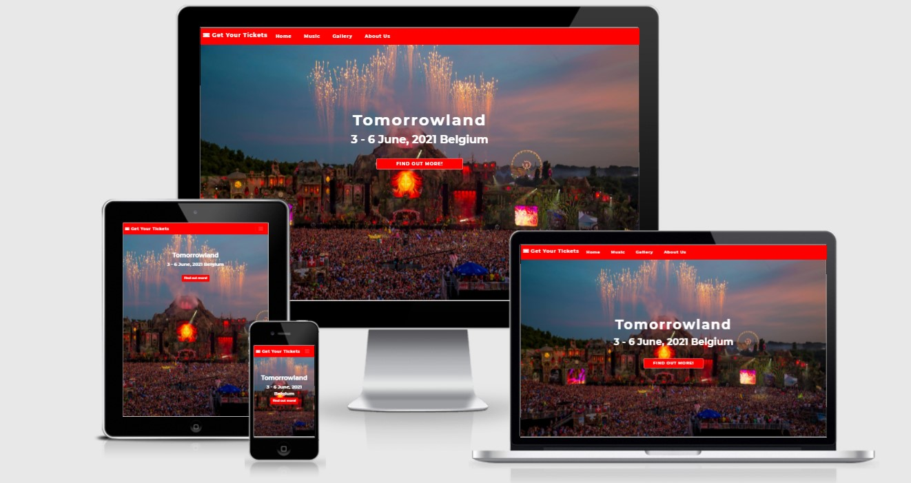
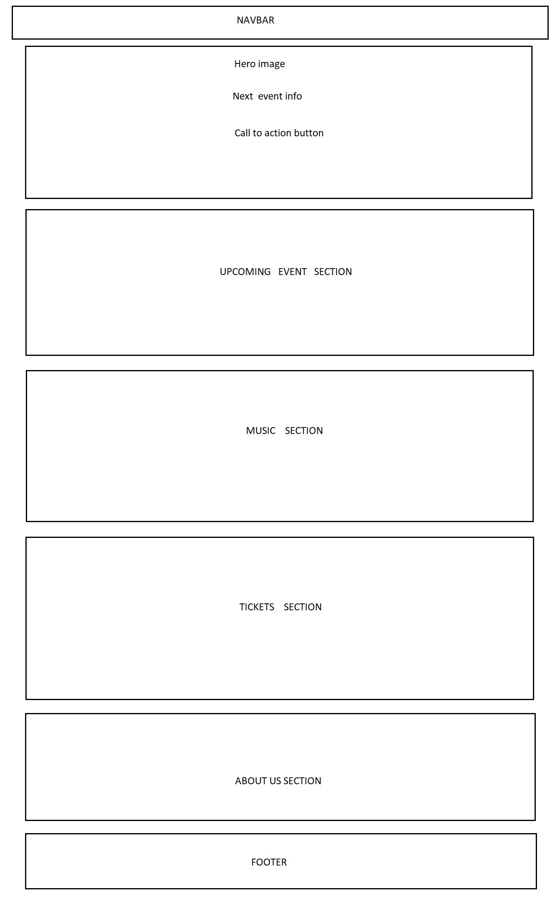
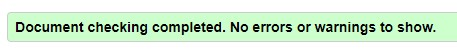
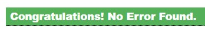
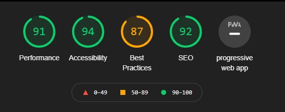

<h1 align="center">Tomorrowland Music Festival Website</h1>

[View the live project here.](https://razvansy.github.io/1st-maelstone-project/)

## This website is about Tomorrowland music festival and It's a one page website. 
## I choose to do it like this for a better performance and mostly to get rid of the loading time when accessing separatly pages.

<h2 align="center"></h2>

## User Experience (UX)

-   ### User stories

    -   #### First Time Visitor Goals

        1.The website is made for techno-house music lovers and people who would like to attend or find out more about this event.
        Sometimes you feel like you need to take a break from your rutine to enjoy your life and Tomorrowland is the perfect event for that. You can meet people from any country on the globe
        or have fun with your friends.
        New users can find very easy information about  upcoming events, music, tickets and Tomorrowland history.

    -   #### Returning Visitor Goals

        1. As a Returning Visitor, I want to find information about upcoming events.
        2. As a Returning Visitor, I want to find the best way to get in contact with the organisation with any questions I may have.
        3. As a Returning Visitor, I want to find event location and tickets price.

    -   #### Frequent User Goals
        1. As a Frequent User, I want to check to see if there are any newly added events.
        2. As a Frequent User, I want to check to see if there are any new Dj invited and any new features for the festival.
        3. As a Frequent User, I want to sign up to the Newsletter so that I am emailed about any changes regarding the festival.

-   ### Design
    -   #### Colour Scheme
        -   The three main colours used are Orange (#ff0000), Black (#000) and White (#fff).
    -   #### Typography
        -   The Montserrat font is the main font used throughout the whole website with Sans Serif as the fallback font in case for any reason the font isn't being imported into the site correctly. Montserrat is a clean font used very often, so it is both attractive and appropriate.
    -   #### Imagery
        -   The hero image describes the event and what you can expect attending the festival.

*   ### Wireframes

    -  I have decided to create a one page website for better loading time and phone user experience. 
    -  Wireframe :  
       <h1 align="left"></h1>

## Features

-   Responsive on all device sizes

-   Interactive elements

## Technologies Used

### Languages Used

-   [HTML5](https://en.wikipedia.org/wiki/HTML5)
-   [CSS3](https://en.wikipedia.org/wiki/Cascading_Style_Sheets)

### Frameworks, Libraries & Programs Used

1. [Bootstrap 4.4.1:](https://getbootstrap.com/docs/4.4/getting-started/introduction/)
    - Bootstrap was used to assist with the responsiveness of the website.
1. [Hover.css:](https://ianlunn.github.io/Hover/)
    - Hover.css was used on icons for better user experience.
1. [Google Fonts:](https://fonts.google.com/)
    - Google fonts were used to import the 'Montserrat' font into the style.css file which is used for website content.
1. [Font Awesome:](https://fontawesome.com/)
    - Font Awesome was used  to add icons.
1. [Git](https://git-scm.com/)
    - Git was used for version control by utilizing the Gitpod terminal to commit to Git and Push to GitHub.
1. [GitHub:](https://github.com/)
    - GitHub is used to store the projects code after being pushed from Git.
1. [Paint:](https://support.microsoft.com/en-us/windows/open-microsoft-paint-ead1dc5c-abc4-fd2c-d81e-ebb013fbc113)
    - Paint was used to create the Wireframe.
## Testing

The W3C Markup Validator and W3C CSS Validator Services were used to validate html code and css.

-   [W3C Markup Validator](https://jigsaw.w3.org/css-validator/#validate_by_input) 
    <h3></h3>
-   [W3C CSS Validator](https://jigsaw.w3.org/css-validator/#validate_by_input) 
    <h3></h3>

### Testing User Stories from User Experience (UX) Section

-   #### First Time Visitor Goals

    1. As a First Time Visitor, I want to easily understand the main purpose of the site and find out more about the festival.

        1. New users - can immediately see the large hero image which describes the main purpose of the website.
        2. New users - can scroll down or use the sticky navigation bar to take them on the right section of the website.
        3. New users - can use call to action button under the title  ( Find out more !) to find out more about the upcoming event.
        4. New users - can find out more about artists and theyr music accessing 'Music' section. 
        5. New users - can read about the festival history accessing 'About Us' section.
        6. New users - can subscribe and be up to date with any changes, using the form at the bottom of the page. 

-   #### Returning Visitor Goals

    1. As a Returning Visitor, I want to find information about the upcoming event.
            
        1. Returning users - can find out about upcoming event by clicking the call to action button on the home page.
        2. Returning users - can contact the organisation for any problems they may have using the phone number or email address displayed on the footer at the bottom of the page.
        3. Returning users - can listen theyr favorit DJ, accessing 'Music' section on the navigation bar.
         

-   #### Frequent User Goals

    1. As a Frequent User, I want to check to see if the information about the upcoming event is displayed.
       
        1. Frequent users - can find out the date for upcoming event just reading the information under the title on the home page.
        2. Frequent users - can check the price tickets for upcoming event by clicking 'Get Your tickets' section on the navigation bar.
        3. Frequent users - can use the phone number or email address of the organisation if they have any questions about the upcoming event.
             

### Further Testing

-   The Website was tested on Google Chrome, Microsoft Edge and Mozilla Firefox.
-   The website was viewed on a variety of devices such as Desktop, Laptop, iPhone 7 Plus, Huawei P20 Pro, Samsung Galaxy A8.
-   Friends and family members were asked to review the site and documentation to point out any bugs and/or user experience issues.
    <h3></h3>

### Known Bugs

- I didn't find any bugs during the time i spent on the website. If you find any bugs,
  I will really appreciate if you let me now by sending me a message on [Linkedin](https://www.linkedin.com/in/razvan-sacaleanu-332351202/).
   

### GitHub Pages

The project was deployed to GitHub Pages using the following steps...

1. Log in to GitHub and locate the [GitHub Repository](https://github.com/)
2. At the top of the Repository (not top of page), locate the "Settings" Button on the menu.
    - Alternatively Click [Here](https://raw.githubusercontent.com/) for a GIF demonstrating the process starting from Step 2.
3. Scroll down the Settings page until you locate the "GitHub Pages" Section.
4. Under "Source", click the dropdown called "None" and select "Master Branch".
5. The page will automatically refresh.
6. Scroll back down through the page to locate the now published site [link](https://github.com) in the "GitHub Pages" section.

### Forking the GitHub Repository

By forking the GitHub Repository we make a copy of the original repository on our GitHub account to view and/or make changes without affecting the original repository by using the following steps...

1. Log in to GitHub and locate the [GitHub Repository](https://github.com/)
2. At the top of the Repository (not top of page) just above the "Settings" Button on the menu, locate the "Fork" Button.
3. You should now have a copy of the original repository in your GitHub account.

### Making a Local Clone

1. Log in to GitHub and locate the [GitHub Repository](https://github.com/)
2. Under the repository name, click "Clone or download".
3. To clone the repository using HTTPS, under "Clone with HTTPS", copy the link.
4. Open Git Bash
5. Change the current working directory to the location where you want the cloned directory to be made.
6. Type `git clone`, and then paste the URL you copied in Step 3.

```
$ git clone https://github.com/YOUR-USERNAME/YOUR-REPOSITORY
```

7. Press Enter. Your local clone will be created.

```
$ git clone https://github.com/YOUR-USERNAME/YOUR-REPOSITORY
> Cloning into `CI-Clone`...
> remote: Counting objects: 10, done.
> remote: Compressing objects: 100% (8/8), done.
> remove: Total 10 (delta 1), reused 10 (delta 1)
> Unpacking objects: 100% (10/10), done.
```

Click [Here](https://help.github.com/en/github/creating-cloning-and-archiving-repositories/cloning-a-repository#cloning-a-repository-to-github-desktop) to retrieve pictures for some of the buttons and more detailed explanations of the above process.


### Code

-   [Bootstrap4](https://getbootstrap.com/docs/4.4/getting-started/introduction/): Bootstrap Library used throughout the project mainly to make site responsive using the Bootstrap Grid System.


### Content

- Dj section content is written from wikipedia.
- About us section is written from wikipedia.


### Media

-   All images are downloaded from here - (https://wallpaperaccess.com/tomorrowland-4k)

### Acknowledgements

-   Thank you to my Mentor, Antonio Rodriguez, for helpful feedback.
-   Many thanks to Slack community.
